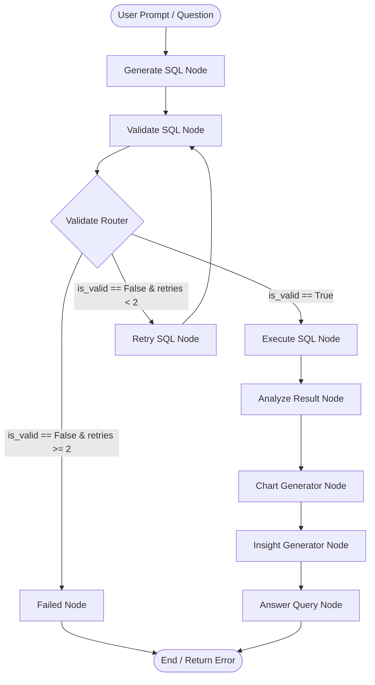

# Natural Language SQL Agent

An intelligent, multi-turn **Text-to-SQL AI Agent** built with **LangGraph**, **Google Gemini**, **SQLAlchemy**, and **FastAPI**, accompanied by an interactive **React** dashboard.

The agent translates natural language questions into database queries, validates queries against security policies, automatically retries broken queries, executes them across multiple database engines (SQLite, MySQL, PostgreSQL), generates visualization chart configurations, extracts business insights, and preserves conversation state using persistent **LangGraph SQLite Checkpointing**.

---

## 🌟 Key Features

* **Multi-Database Connectivity**: Dynamically connect to **SQLite** (via file uploads), **MySQL**, and **PostgreSQL** using SQLAlchemy database engine management.
* **LangGraph Stateful Agent Architecture**: Structured multi-node graph execution covering query generation, safety validation, automated retries, execution, result analysis, charting, insight generation, and final natural language answer synthesis.
* **Automated Validation & Security Guardrails**: Cleans markdown fences and enforces strict read-only execution policies (blocks `DROP`, `DELETE`, `UPDATE`, `INSERT`, `ALTER`, `TRUNCATE`, `CREATE`, `REPLACE`, `GRANT`, `REVOKE`).
* **Self-Correction Retry Loop**: Automatically routes invalid queries back to Gemini with database schema context and previous invalid SQL (up to `MAX_RETRIES = 2`).
* **Persistent Thread/Session Memory**: Utilizes LangGraph's `SqliteSaver` to persist graph state snapshots into a local SQLite database (`checkpoints.sqlite`), maintaining conversation history across turns per `thread_id`.
* **Automated Chart & Analytics Generator**: AI-driven analyzer node determines whether a result set warrants visualization and formats data into dynamic chart payloads (Bar, Line, Pie, Scatter).
* **Automated Business Insights**: AI business analyst node synthesizes 3-5 concise, single-sentence bullet points summarizing key trends, extremes, and findings.
* **Interactive React Frontend**: Modern Vite + React interface featuring a database connection modal, interactive schema explorer with table previews, dynamic chat interface, SQL display, data tables, and Chart.js rendering.

---

## 🛠️ Tech Stack

### Backend
* **Python 3.10+**
* **FastAPI** & **Uvicorn**: RESTful Web Server API
* **LangGraph** & **LangChain Core**: AI Workflow Orchestration & Message Management
* **Google Gemini (`gemini-3.6-flash`)**: LLM for SQL generation, result analysis, and natural language response synthesis
* **`langgraph-checkpoint-sqlite`**: SQLite-backed state checkpointer (`SqliteSaver`)
* **SQLAlchemy**: Multi-database connection manager and raw query execution engine
* **PyMySQL** & **Psycopg2**: Database drivers for MySQL and PostgreSQL

### Frontend
* **React 19** & **Vite**: Modern UI framework and build setup
* **Chart.js** & **React-Chartjs-2**: Dynamic data visualization
* **Lucide React**: UI icons
* **Vanilla CSS**: Clean visual design and responsiveness

---

## 📐 Architecture & Workflow

The core agent workflow is constructed as a stateful `StateGraph` in LangGraph.

### Agent Flow Diagram



### LangGraph Workflow Stages

1. **`generate_sql`**: Reads database schema and thread conversation history to prompt Gemini for SQLite SELECT syntax.
2. **`validate_sql`**: Strips markdown blocks and verifies that the query starts with `SELECT` and contains no destructive SQL keywords.
3. **`validate_route`**: Conditional router determining whether to proceed to execution, attempt a self-correction retry, or terminate as failed.
4. **`retry_sql`**: Increments `retries` count and prompts Gemini with the previous invalid SQL and schema to obtain a corrected query.
5. **`execute_sql`**: Runs validated query against the connected SQLAlchemy database engine and converts rows into standard Python dictionaries.
6. **`analyze`**: Evaluates query results and decides whether to generate charts (bar, line, pie, scatter) and business insights.
7. **`chart`**: Extracts X/Y axis series data from result dictionaries for Chart.js rendering.
8. **`insights`**: Prompts Gemini to generate 3-5 concise, actionable business summary points based on the returned dataset.
9. **`answer_query`**: Generates natural language summary of the dataset and appends `HumanMessage` and `AIMessage` to thread conversation history in `GraphState`.
10. **`failed`**: Returns a graceful fallback message when query validation cannot pass within maximum retries.

---

## 💾 Thread & Session Persistence (`SqliteSaver`)

State persistence is managed via LangGraph's `SqliteSaver` checkpointer.

```python
from langgraph.checkpoint.sqlite import SqliteSaver
import sqlite3

db_path = os.path.join(os.path.dirname(__file__), "checkpoints.sqlite")
conn = sqlite3.connect(db_path, check_same_thread=False)
memory = SqliteSaver(conn)
memory.setup()

workflow = graph.compile(checkpointer=memory)
```

* **Thread Snapshots**: Every state modification across graph nodes is committed to `backend/checkpoints.sqlite` using a unique `thread_id`.
* **Multi-Turn Context**: Past user questions and assistant answers stored in `state["messages"]` are preserved across requests, allowing follow-up questions (e.g., *"Filter the previous query by year 2023"*).

---

## 📂 Project Structure

```
Natural Language SQL Agent/
├── backend/
│   ├── analyzer.py            # AI result analysis & chart type determination
│   ├── api.py                 # FastAPI application routes & endpoints
│   ├── chart_generator.py     # Prepares chart labels and data arrays
│   ├── checkpoints.sqlite     # LangGraph SqliteSaver local state checkpoint database
│   ├── config.py              # Application settings (MAX_RETRIES = 2)
│   ├── database.py            # SQLAlchemy DatabaseManager (SQLite, MySQL, Postgres)
│   ├── formatter.py           # Text formatting utilities
│   ├── graph.py               # LangGraph StateGraph definition & SqliteSaver setup
│   ├── insight_generator.py   # AI business insight generation node
│   ├── llm.py                 # Gemini LLM setup (gemini-3.6-flash)
│   ├── main.py                # CLI runner entrypoint
│   ├── models.py              # Pydantic request models (ChatRequest, ConnectRequest)
│   ├── nodes.py               # Graph node function implementations
│   ├── retry_generator.py     # Self-correction query retry logic
│   ├── routes.py              # Conditional routing logic (validate_route)
│   ├── sql_generator.py       # SQL query generation prompt logic
│   ├── sql_validator.py       # Query syntax cleaner & read-only safety checker
│   ├── state.py               # GraphState TypedDict definition
│   └── uploads/               # Uploaded SQLite database files storage
├── database/
│   └── Chinook.sqlite         # Sample SQLite database (Chinook music database)
├── frontend/
│   ├── public/                # Static web assets
│   ├── src/
│   │   ├── components/        # React components (ChatWorkspace, SchemaExplorer, etc.)
│   │   ├── App.css            # Styles for main layout
│   │   ├── App.jsx            # Main dashboard component
│   │   ├── index.css          # Design system & CSS variables
│   │   └── main.jsx           # React app entry point
│   ├── package.json           # Frontend dependencies & Vite scripts
│   └── vite.config.js         # Vite configuration file
├── .env                       # Environment variables (API Keys)
├── .gitignore                 # Git ignore rules
├── requirements.txt           # Python backend dependencies
└── README.md                  # Project documentation
```

---

## ⚡ Prerequisites & Setup

### Prerequisites
* **Python**: 3.10 or higher
* **Node.js**: 18.0 or higher
* **npm**: 9.0 or higher
* **Google Gemini API Key**: Obtain from [Google AI Studio](https://aistudio.google.com/)

### 1. Environment Configuration
Create a `.env` file in the project root:

```env
GOOGLE_API_KEY=your_gemini_api_key_here
```

### 2. Backend Setup

```bash
# Create and activate Python virtual environment
python -m venv my_env

# Windows PowerShell:
.\my_env\Scripts\Activate.ps1
# Linux/macOS:
source my_env/bin/activate

# Install Python dependencies
pip install -r requirements.txt
```

### 3. Frontend Setup

```bash
# Navigate to frontend folder
cd frontend

# Install Node dependencies
npm install
```

---

## 🚀 Running the Application

### Start Backend Server

```bash
# From project root directory
cd backend
uvicorn api:app --reload --port 8000
```
Backend API will run at `http://localhost:8000`.

### Start Frontend Server

```bash
# From frontend folder
cd frontend
npm run dev
```
Frontend application will be available at `http://localhost:5173`.

---

## 📡 API Endpoints & Example Usage

### 1. Upload SQLite Database (`POST /upload-sqlite`)
Uploads a `.sqlite` or `.db` file and connects it to the engine.

```bash
curl -X POST "http://localhost:8000/upload-sqlite" \
  -F "file=@database/Chinook.sqlite"
```

### 2. Connect Database (`POST /connect`)
Connects to a MySQL or PostgreSQL server.

```json
POST /connect
{
  "db_type": "mysql",
  "host": "localhost",
  "port": 3306,
  "username": "root",
  "password": "yourpassword",
  "database": "sales_db"
}
```

### 3. Get Schema (`GET /schema`)
Returns all tables and column definitions.

```json
GET /schema
{
  "success": true,
  "schema": {
    "Artist": [
      { "name": "ArtistId", "type": "INTEGER" },
      { "name": "Name", "type": "NVARCHAR(120)" }
    ]
  }
}
```

### 4. Execute Chat Query (`POST /chat`)
Executes a multi-turn natural language question through the LangGraph workflow.

**Request:**
```json
POST /chat
{
  "question": "What are the top 5 most popular music genres by track count?",
  "thread_id": "session-12345"
}
```

**Response:**
```json
{
  "thread_id": "session-12345",
  "question": "What are the top 5 most popular music genres by track count?",
  "sql": "SELECT Genre.Name, COUNT(Track.TrackId) AS TrackCount FROM Track JOIN Genre ON Track.GenreId = Genre.GenreId GROUP BY Genre.Name ORDER BY TrackCount DESC LIMIT 5;",
  "result": [
    { "Name": "Rock", "TrackCount": 1297 },
    { "Name": "Latin", "TrackCount": 579 },
    { "Name": "Metal", "TrackCount": 374 },
    { "Name": "Alternative & Punk", "TrackCount": 332 },
    { "Name": "Jazz", "TrackCount": 130 }
  ],
  "answer": "The top 5 most popular music genres by track count are Rock (1,297 tracks), Latin (579 tracks), Metal (374 tracks), Alternative & Punk (332 tracks), and Jazz (130 tracks).",
  "analysis": {
    "generate_chart": true,
    "chart_type": "bar",
    "generate_insights": true
  },
  "chart": {
    "type": "bar",
    "title": "TrackCount by Name",
    "x_label": "Name",
    "y_label": "TrackCount",
    "x": ["Rock", "Latin", "Metal", "Alternative & Punk", "Jazz"],
    "y": [1297, 579, 374, 332, 130]
  },
  "insights": "• Rock is by far the leading genre with nearly double the tracks of Latin.\n• The top 3 genres account for the vast majority of the catalog.\n• Jazz has the lowest representation among the top 5 with 130 tracks."
}
```

---

## 🛡️ Error Handling & Self-Correction

When an invalid or unsafe SQL query is generated:
1. **Safety Filter**: If the query attempts non-SELECT operations (`DELETE`, `DROP`, `UPDATE`, etc.), `validate_sql` raises a `ValueError`.
2. **Retry Route**: `validate_route` detects `is_valid == False` and checks `retries < MAX_RETRIES`.
3. **LLM Re-prompting**: `retry_sql` passes the invalid query and schema back to Gemini to request a corrected query.
4. **Fallback**: If the query remains invalid after 2 retry attempts, the workflow routes to `failed_node`, returning a clean failure message to the client without breaking the backend.

---

## 🔮 Future Enhancements

* Add support for enterprise databases such as SQL Server and Snowflake.
* Implement query result caching to reduce LLM calls for recurring questions.
* Add option to export generated charts and business insights to PDF/CSV reports.
* Integrate schema indexing/embeddings for massive database schemas with hundreds of tables.

---

## 👤 Author

Developed as a modern Natural Language SQL Agent project using Python, LangGraph, and React.
